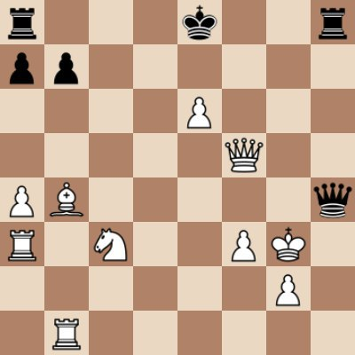

# Телеграм-бот для игры в шахматы

Простой телеграм-бот на Node.js. Для генерации ходов, проверки на шах/мат/пат и т.д. используется [chess.js](https://github.com/jhlywa/chess.js). Для отрисовки доски – [node-canvas](https://github.com/Automattic/node-canvas).
  
Игра заканчивается в случае мата, ничьи, пата или повторения трех одинковых ходов. 
  
## Как выглядит:

  
  
## Доступные нотации:
Бот принимает ходы по классической нотации с указанием начального и конечного поля играющей фигуры.  
  
Пример:  
```
e2-e4
d7-d6
d2-d4
```

## Live demo:  
[@chess_zugzwang_bot](https://t.me/chess_zugzwang_bot)

## Используемые библиотеки:  
* [node-telegram-bot-api](https://github.com/yagop/node-telegram-bot-api)
* [chess.js](https://github.com/jhlywa/chess.js)
* [canvas](https://github.com/Automattic/node-canvas)